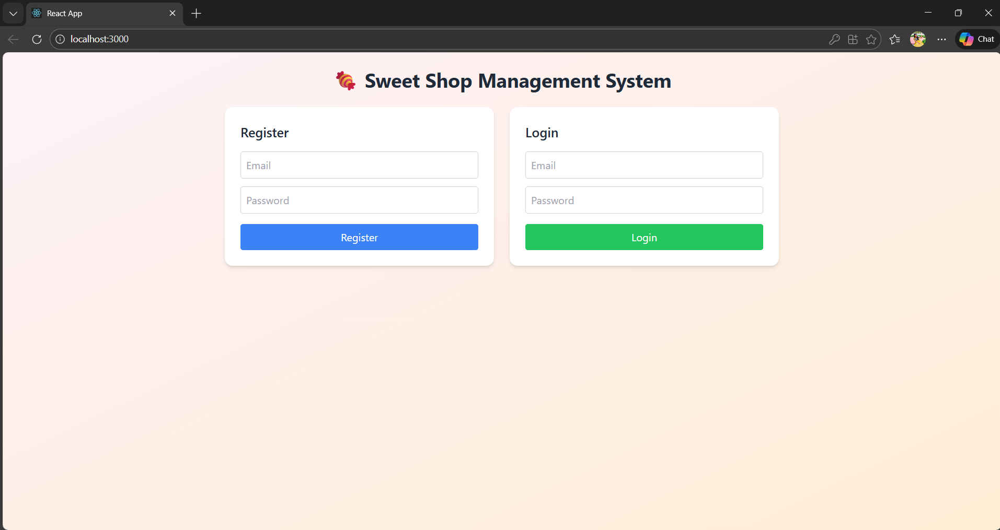
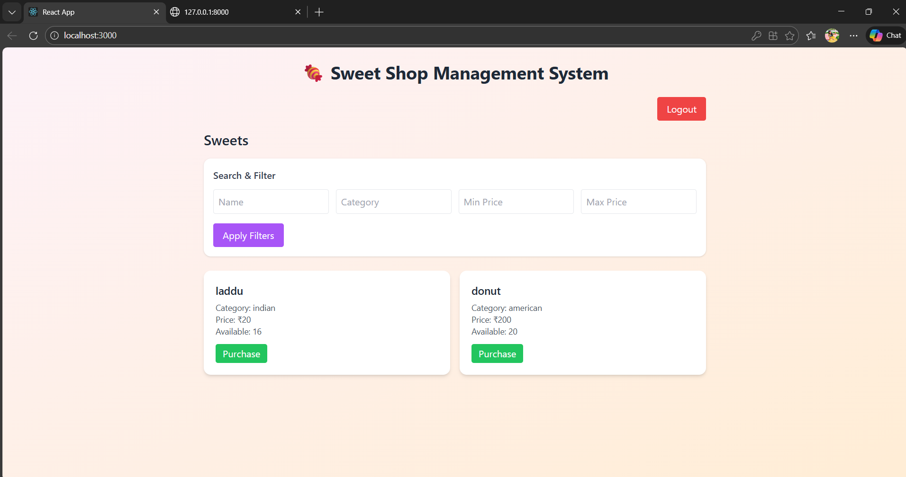
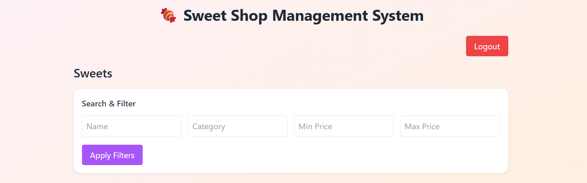
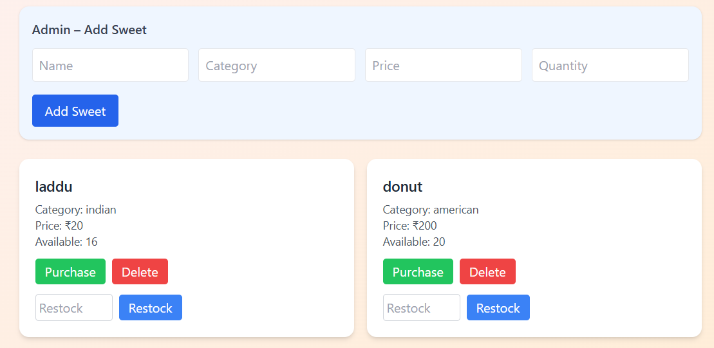

# 🍬 Sweet Shop Management System

A full-stack Sweet Shop Management System built using **FastAPI**, **SQLite**, and **React**.  
This project implements secure authentication, role-based access control, inventory management, and a modern interactive user interface.

This application was developed as part of the **AI Kata – Sweet Shop Management System** assignment.

---

## 📌 Features

### 🔐 Authentication & Authorization
- User registration and login
- JWT-based authentication
- Secure protected routes
- Role-based access control (Admin vs User)

### 🍭 Sweets Management
- View all available sweets
- Search and filter sweets by:
  - Name
  - Category
  - Price range
- Purchase sweets
- Purchase disabled automatically when stock is zero

### 🧑‍💼 Admin Controls
- Add new sweets
- Update sweet details
- Delete sweets
- Restock inventory
- Admin-only access enforced at backend level

### 📦 Inventory Management
- Quantity tracking for each sweet
- Purchase reduces inventory count
- Restock increases inventory
- Inventory persists using a real database

### 🎨 Frontend UI
- Single Page Application (SPA) using React
- Modern, responsive, and interactive UI
- Card-based layout with hover effects
- Clear separation of admin and user features

---

## 🧱 Tech Stack

### Backend
- FastAPI
- SQLAlchemy
- SQLite (persistent, file-based database)
- JWT authentication (python-jose)
- Pytest for testing

### Frontend
- React
- Tailwind CSS
- Fetch API

---

## 🗄️ Database

- SQLite is used as a persistent relational database.
- Data is stored in `sweetshop.db`.
- This satisfies the requirement of using a real database (not an in-memory store).

---

## 🧪 Testing & TDD

The backend was developed using **Test-Driven Development (TDD)** principles:

- Tests written before feature implementation
- Database state isolated between tests
- Coverage includes:
  - Authentication
  - Sweet creation, listing, update, and deletion
  - Inventory purchase and restock logic

A backend test report is included in the repository.

---

## 🚀 How to Run the Project

### 1️⃣ Clone the Repository

```bash
git clone https://github.com/<your-username>/sweet-shop-management.git
cd sweet-shop-management
```

### 2️⃣ Backend Setup

```bash
cd backend
python -m venv venv
venv\Scripts\activate   # Windows
pip install -r requirements.txt
uvicorn app.main:app --reload
```
Backend will run at: http://127.0.0.1:8000

API documentation: http://127.0.0.1:8000/docs

### 3️⃣ Frontend Setup

```bash
cd frontend/sweet-shop-ui
npm install
npm start
```
Frontend will run at: http://localhost:3000

---

## 👩‍💻 User Roles

### Regular User

- Register & login
- View sweets
- Search & filter sweets
- Purchase sweets

### Admin

- All user features
- Add sweets
- Update sweets
- Delete sweets
- Restock inventory

---

## 📸 Screenshots

### 🔑 Login & Register


### 🍬 Sweets Dashboard


### 🔍 Search & Filter


### 🧑‍💼 Admin Controls


---

## 🤖 AI Usage Disclosure

AI tools (ChatGPT) were used during this project in the following ways:
- Understanding requirements and edge cases
- Debugging FastAPI and SQLAlchemy issues
- Refining API design and authorization flow
- Improving frontend UI structure and styling
- Guidance on Tailwind CSS usage
- Clarifying testing strategies and TDD patterns

AI co-author attribution has been added to commits where AI directly contributed to code generation or structural changes.

For earlier exploratory commits, AI was primarily used as a learning and reference tool, while final design and implementation decisions were made and validated manually.

---

## 📈 Future Improvements

- User order history
- Pagination for sweets list
- Deployment (Docker / cloud)
- Role management UI
- Improved test coverage for frontend
